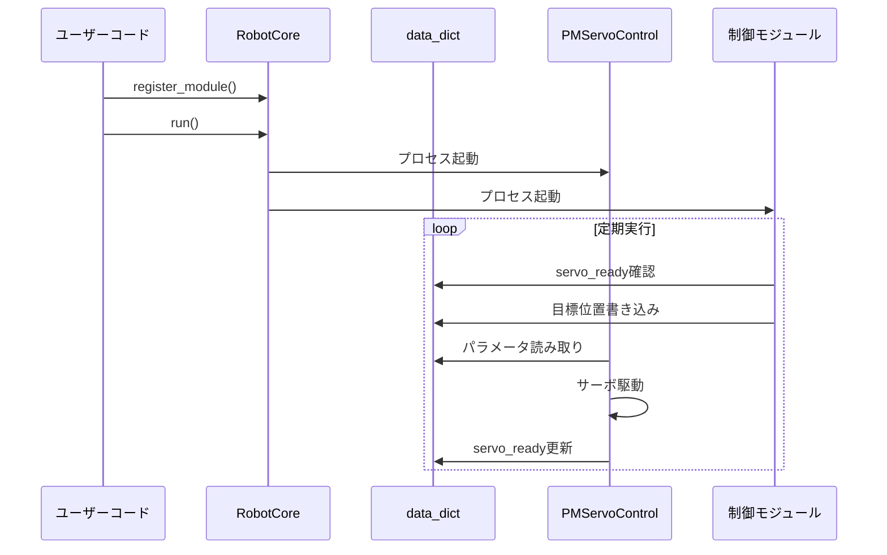

# 🚀 2. クイックスタート

このガイドでは、SOURを使って初めてのロボット制御プログラムを作成する手順を説明します。

---

## 📋 前提条件

### 必須環境
- **Python**: 3.x以降
- **OS**: Linux (Raspberry Pi推奨), macOS, Windows

### 推奨ハードウェア
- Raspberry Pi (またはLinuxが動作するシングルボードコンピュータ)
- サーボモータとサーボコントローラ (Hiwonder Serial Bus Servo Controllerなど)
- センサー類 (オプション)

---

## 🔧 インストール

### 1. リポジトリのクローン

```bash
git clone https://github.com/shoyamasuzukilab/SOUR.git
cd SOUR
```

### 2. 依存パッケージのインストール

```bash
pip install -r requirements.txt
```

主な依存パッケージ:
- `pyserial`: シリアル通信用
- `smbus2`: I2C通信用 (センサー利用時)

### 3. 動作確認

```bash
python main.py
```

正常に起動すれば、以下のメッセージが表示されます:
```
SOUR: Simple Operation for Ubiquitous Robotics
```

---

## 🎯 基本的な使い方

### Step 1: RobotPropertiesの設定

ロボットの物理的特性を設定します。

```python
from src.core.robot_properties import RobotProperties, ServoEasingFunctions

robot_properties = RobotProperties()

# サーボモータの数
robot_properties.num_servos = 4

# サーボIDの指定
robot_properties.servo_ids = [0, 1, 2, 3]

# サーボの可動範囲 (PWM値)
robot_properties.servo_min_positions = [500.0, 500.0, 500.0, 500.0]
robot_properties.servo_max_positions = [2500.0, 2500.0, 2500.0, 2500.0]

# 初期位置
robot_properties.servo_initial_positions = [1500.0, 1500.0, 1500.0, 1500.0]

# 位置補正値
robot_properties.servo_shifts = [0.0, 0.0, 0.0, 0.0]

# イージング関数
robot_properties.servo_easing_function = ServoEasingFunctions.EASE_IN_OUT_CUBIC

# 通信ポート
robot_properties.servo_controller_port = '/dev/ttyAMA2'
```

参照: [../src/core/robot_properties.py](../src/core/robot_properties.py:1-30)

### Step 2: RobotCoreの作成

```python
from src.core.robot_core import RobotCore

r_core = RobotCore(robot_properties)
```

`RobotCore`は以下を管理します:
- 登録されたモジュールの実行
- 共有メモリ(`data_dict`)の管理
- プロセス間の同期

参照: [../src/core/robot_core.py](../src/core/robot_core.py:1-50)

### Step 3: モジュールの登録

サーボ制御モジュールを登録します。

```python
from src.modules.pm_servo_control_hiwonder_serial_bus_servo_controller import PMServoControlHiwonderSerialBusServoController

# サーボ制御モジュール (50ms周期)
servo_control = PMServoControlHiwonderSerialBusServoController(
    robot_properties, 
    interval_ms=50
)
r_core.register_module(servo_control)
```

### Step 4: カスタム制御モジュールの作成

```python
from src.core.periodic_module import PeriodicModule
import time

class MyControlModule(PeriodicModule):
    def __init__(self, robot_properties, interval_ms=1000):
        super().__init__(interval_ms)
        self.robot_properties = robot_properties
        self.step = 0
    
    def execute_periodic_task(self, lock, data_dict):
        # 親クラスのメソッドを呼び出す (終了フラグチェック)
        super().execute_periodic_task(lock, data_dict)
        
        # サーボが動作可能か確認
        if data_dict['servo_ready']:
            # サーボ目標位置を設定
            target_positions = [1500.0, 1500.0, 1500.0, 1500.0]
            operation_times = [1000, 1000, 1000, 1000]  # 1秒で移動
            
            # 共有メモリに書き込み
            self.write_servo_positions(
                lock, 
                data_dict, 
                target_positions, 
                operation_times
            )
            
            print(f"Step {self.step}: Servo command sent")
            self.step += 1

# モジュールを登録
r_core.register_module(MyControlModule(robot_properties, 1000))
```

参照: [../src/core/periodic_module.py](../src/core/periodic_module.py:1-50)

### Step 5: 実行

```python
r_core.run()
```

---

## 🎨 完全なサンプルコード

以下は、サーボモータを制御する完全なサンプルです:

```python
from src.core.robot_core import RobotCore
from src.core.robot_properties import RobotProperties, ServoEasingFunctions
from src.core.periodic_module import PeriodicModule
from src.modules.pm_servo_control_hiwonder_serial_bus_servo_controller import PMServoControlHiwonderSerialBusServoController

class SimpleDemo(PeriodicModule):
    def __init__(self, robot_properties, interval_ms=2000):
        super().__init__(interval_ms)
        self.toggle = False
    
    def execute_periodic_task(self, lock, data_dict):
        super().execute_periodic_task(lock, data_dict)
        
        if data_dict['servo_ready']:
            if self.toggle:
                positions = [2000.0, 2000.0, 2000.0, 2000.0]
            else:
                positions = [1000.0, 1000.0, 1000.0, 1000.0]
            
            times = [1000, 1000, 1000, 1000]
            self.write_servo_positions(lock, data_dict, positions, times)
            
            self.toggle = not self.toggle
            print(f"Servo positions: {positions}")

def main():
    # ロボット特性の設定
    robot_properties = RobotProperties()
    robot_properties.num_servos = 4
    robot_properties.servo_ids = [0, 1, 2, 3]
    robot_properties.servo_min_positions = [500.0, 500.0, 500.0, 500.0]
    robot_properties.servo_max_positions = [2500.0, 2500.0, 2500.0, 2500.0]
    robot_properties.servo_initial_positions = [1500.0, 1500.0, 1500.0, 1500.0]
    robot_properties.servo_shifts = [0.0, 0.0, 0.0, 0.0]
    robot_properties.servo_easing_function = ServoEasingFunctions.EASE_IN_OUT_CUBIC
    robot_properties.servo_controller_port = '/dev/ttyAMA2'
    
    # RobotCoreの作成
    r_core = RobotCore(robot_properties)
    
    # モジュールの登録
    r_core.register_module(PMServoControlHiwonderSerialBusServoController(robot_properties, 50))
    r_core.register_module(SimpleDemo(robot_properties, 2000))
    
    # 実行
    r_core.run()

if __name__ == "__main__":
    main()
```

---

## 🐛 デバッグモード

デバッグ時は、実際のハードウェアなしでも動作確認できます:

```python
# PMServoControlを使うと、サーボコマンドをコンソールに出力
from src.modules.pm_servo_control import PMServoControl

# ハードウェア通信なしでデバッグ
r_core.register_module(PMServoControl(robot_properties, 50))
```

出力例:
```
command:[1500.0, 1500.0, 1500.0, 1500.0]
command:[1520.3, 1520.3, 1520.3, 1520.3]
...
```

---

## 📊 データフロー



---

## 🔍 トラブルシューティング

### シリアルポートが見つからない

```bash
# Linuxでポートを確認
ls /dev/tty*

# 権限を付与
sudo chmod 666 /dev/ttyAMA2
```

### モジュールが実行されない

- `interval_ms`が適切か確認
- `execute_periodic_task`で`super()`を呼んでいるか確認
- 終了フラグがTrueになっていないか確認

### サーボが動かない

- ハードウェア接続を確認
- `servo_controller_port`が正しいか確認
- PWM値の範囲が適切か確認

---

## 📚 次のステップ

- システムの仕組みを理解する → [アーキテクチャ](./03-アーキテクチャ.md)
- 各コンポーネントを学ぶ → [コアコンポーネント](./05-コアコンポーネント.md)
- 高度なモジュールを作る → [開発ガイド](./09-開発ガイド.md)

---

**参考ファイル**:
- [../main.py](../main.py) - 実際の使用例
- [../src/test/pm_demo_betty.py](../src/test/pm_demo_betty.py) - Bettyロボットのデモ
- [../src/test/pm_demo_shiro.py](../src/test/pm_demo_shiro.py) - Shiroロボットのデモ
