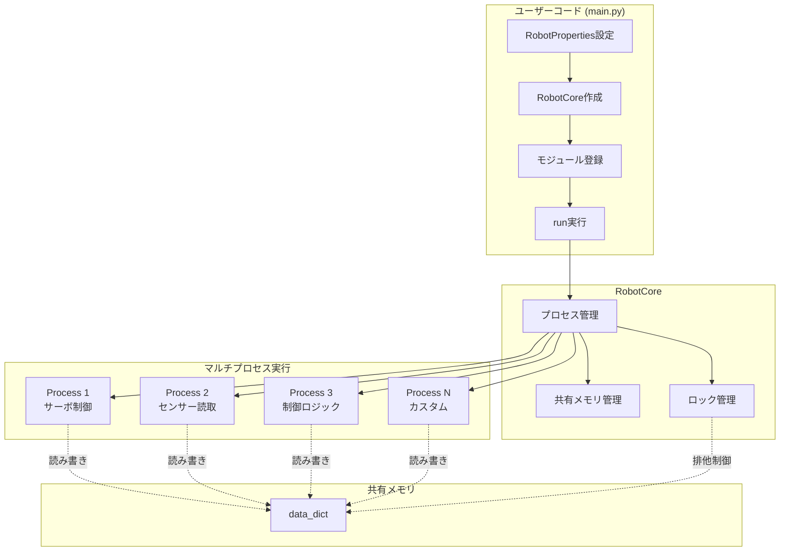
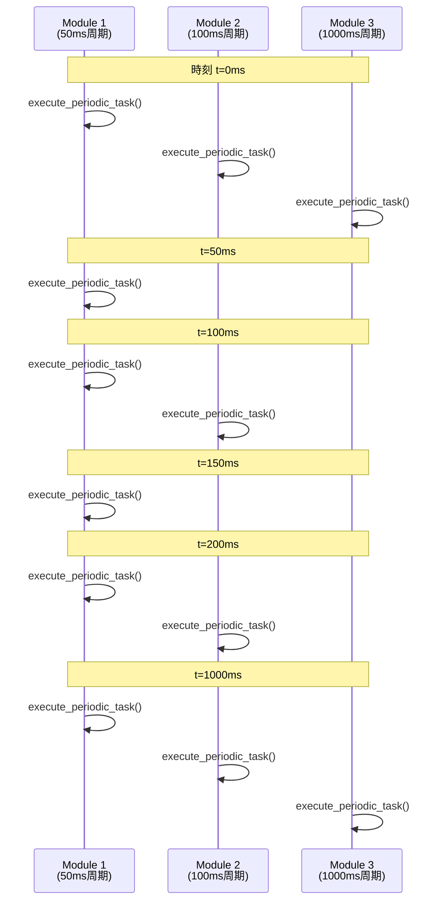
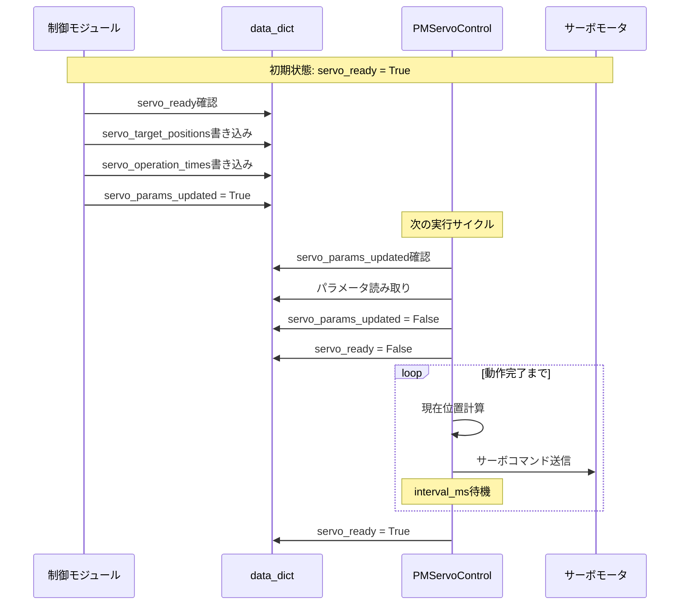
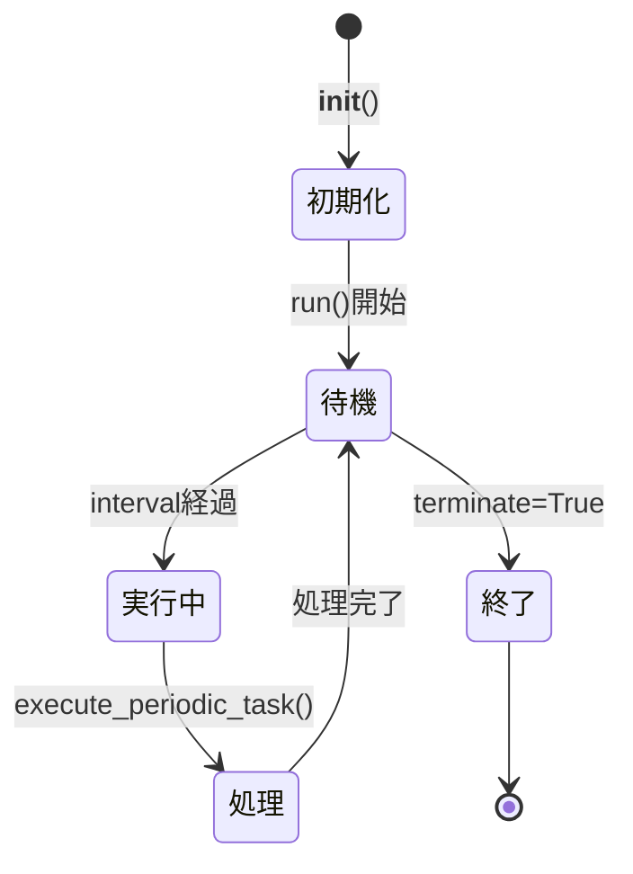

# 🏗️ 3. アーキテクチャ

SOURのアーキテクチャは、**シンプルさ**と**並列性**を両立させた設計になっています。

---

## 🎨 システム全体像



---

## 🔄 マルチプロセス実行モデル

### プロセス生成と実行

SOURではPythonのmultiprocessingを利用し，各`PeriodicModule`が独立したプロセスとして実行されます。

```python
# src/core/robot_core.py より抜粋
def run(self):
    processes = []
    
    # 各モジュールをプロセスとして起動
    for module in self.modules:
        process = multiprocessing.Process(
            target=module.run, 
            args=(self.lock, self.data_dict,)
        )
        processes.append(process)
        process.start()
    
    # すべてのプロセスが終了するまで待機
    for process in processes:
        process.join()
```

参照: [../src/core/robot_core.py](../src/core/robot_core.py:89-110)

### 並列実行の利点

1. **独立性**: 各モジュールは他のモジュールに影響されずに実行
2. **異なる周期**: モジュールごとに最適な実行間隔を設定可能
3. **CPU活用**: マルチコアCPUの性能を活用
4. **障害分離**: 一つのモジュールの異常が他に波及しにくい

---

## ⏱️ 定期実行メカニズム

### タイミング制御

各`PeriodicModule`は指定された間隔で`execute_periodic_task`を実行します。

```python
# src/core/periodic_module.py より抜粋
def run(self, lock, data_dict):
    time0 = time.perf_counter()
    
    while not self.terminate:
        time1 = time.perf_counter()
        
        # 指定間隔を経過したか確認
        if (time1 - time0) * 1000 > self.interval_ms:
            time0 = time1
            
            # 定期実行タスクを実行
            self.execute_periodic_task(lock, data_dict)
```

参照: [../src/core/periodic_module.py](../src/core/periodic_module.py:10-30)

### タイミング図



---

## 💾 共有メモリアーキテクチャ

### data_dict構造

プロセス間でデータを共有するために、`multiprocessing.Manager().dict()`を使用します。

```python
# RobotCoreの初期化時
self.manager = multiprocessing.Manager()
self.data_dict = self.manager.dict()

# サーボ制御用のデータ構造
self.data_dict['servo_target_positions'] = [0.0] * num_servos
self.data_dict['servo_operation_times'] = [0.0] * num_servos
self.data_dict['servo_params_updated'] = False
self.data_dict['servo_ready'] = True
self.data_dict['terminate'] = False
```

参照: [../src/core/robot_core.py](../src/core/robot_core.py:30-52)

### データ構造の例

| キー | 型 | 説明 |
|------|-----|------|
| `servo_target_positions` | list[float] | サーボの目標位置 |
| `servo_operation_times` | list[float] | 各サーボの動作時間(ms) |
| `servo_params_updated` | bool | パラメータ更新フラグ |
| `servo_ready` | bool | サーボ動作完了フラグ |
| `terminate` | bool | 全モジュール終了フラグ |

### カスタムデータの追加

ユーザーは独自のデータを`data_dict`に追加できます:

```python
# センサーデータの書き込み
with lock:
    data_dict['temperature'] = 25.5
    data_dict['humidity'] = 60.0
    data_dict['distance'] = 120.5

# 他のモジュールから読み取り
temp = data_dict['temperature']
```

---

## 🔒 排他制御メカニズム

### ロックの必要性

複数のプロセスが同時に`data_dict`にアクセスするため、データ競合を防ぐ必要があります。

### ロックの使用

```python
# 書き込み時は必ずロックを取得
def write_servo_positions(self, lock, data_dict, servo_positions, servo_operation_times):
    with lock:
        data_dict['servo_target_positions'] = servo_positions
        data_dict['servo_operation_times'] = servo_operation_times
        data_dict['servo_params_updated'] = True
```

参照: [../src/core/periodic_module.py](../src/core/periodic_module.py:51-67)

### ロックのベストプラクティス

✅ **推奨**:
```python
# 短時間のロック
with lock:
    data_dict['value'] = new_value
```

❌ **非推奨**:
```python
# 長時間のロック (他のプロセスがブロックされる)
with lock:
    time.sleep(1)  # NG!
    data_dict['value'] = new_value
```

---

## 🤖 サーボ制御のデータフロー

サーボ制御の具体的なデータフローを見てみましょう。



### フラグの役割

1. **servo_params_updated**
   - 制御モジュールが新しいパラメータを設定したことを通知
   - PMServoControlがこれを検出して動作開始

2. **servo_ready**
   - サーボが動作可能な状態を示す
   - 制御モジュールはこれがTrueの時のみ新しいコマンドを送信

---

## 🔧 モジュールのライフサイクル



### 1. 初期化フェーズ

```python
class MyModule(PeriodicModule):
    def __init__(self, robot_properties, interval_ms=1000):
        super().__init__(interval_ms)
        # モジュール固有の初期化処理
        self.counter = 0
```

### 2. 実行フェーズ

```python
def execute_periodic_task(self, lock, data_dict):
    # 終了フラグのチェック
    super().execute_periodic_task(lock, data_dict)
    
    # 実際の処理
    self.counter += 1
    print(f"Count: {self.counter}")
```

### 3. 終了フェーズ

```python
# 任意のモジュールから全モジュールを終了
self.terminate_all(lock, data_dict)
```

---

## 📊 パフォーマンス特性

### リアルタイム性

SOURは**ソフトリアルタイム**システムです:

- ✅ 多くのロボティクスアプリケーションで十分な性能
- ⚠️ 厳密なハードリアルタイムは保証されない
- 💡 実行間隔を小さくすることで応答性を向上

---

## 🎯 設計の利点と制約

### 利点

1. **シンプル**: 複雑な並行処理を意識せずに開発
2. **柔軟**: モジュールの追加・削除が容易
3. **デバッグしやすい**: モジュール単位でテスト可能
4. **スケーラブル**: モジュール数を増やしても構造は同じ

### 制約

1. **プロセスオーバーヘッド**: 多数のモジュールでは起動時間が増加
2. **メモリ使用量**: 各プロセスが独立したメモリ空間を持つ
3. **データサイズ**: 共有メモリは大きなデータには不向き
4. **タイミング保証**: 厳密なリアルタイム性は保証されない

---

## 🚀 次のステップ

- ファイル構成を確認する → [リポジトリ構造](./04-リポジトリ構造.md)
- 各クラスの詳細を学ぶ → [コアコンポーネント](./05-コアコンポーネント.md)
- 実装例を見る → [サンプル実装](./08-サンプル実装.md)

---

**参考ファイル**:
- [../src/core/robot_core.py](../src/core/robot_core.py) - RobotCoreの実装
- [../src/core/periodic_module.py](../src/core/periodic_module.py) - PeriodicModuleの実装
- [../src/modules/pm_servo_control.py](../src/modules/pm_servo_control.py) - サーボ制御の実装例
