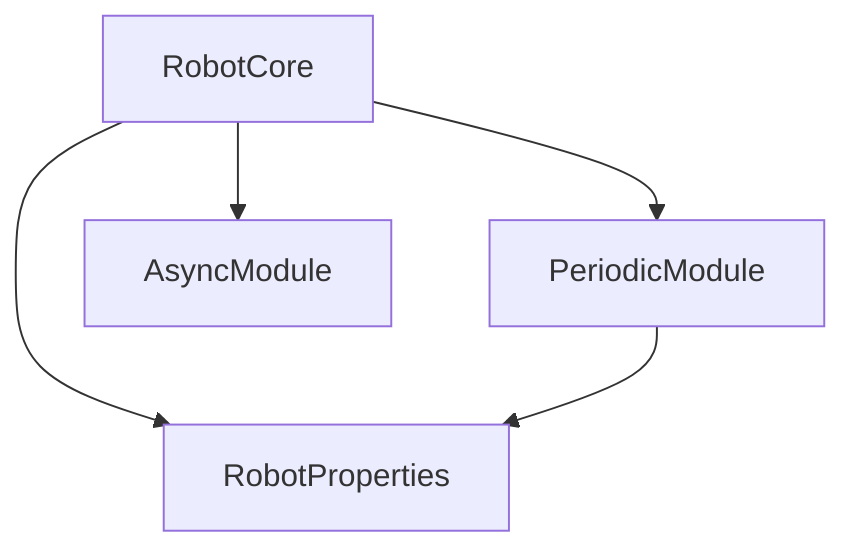
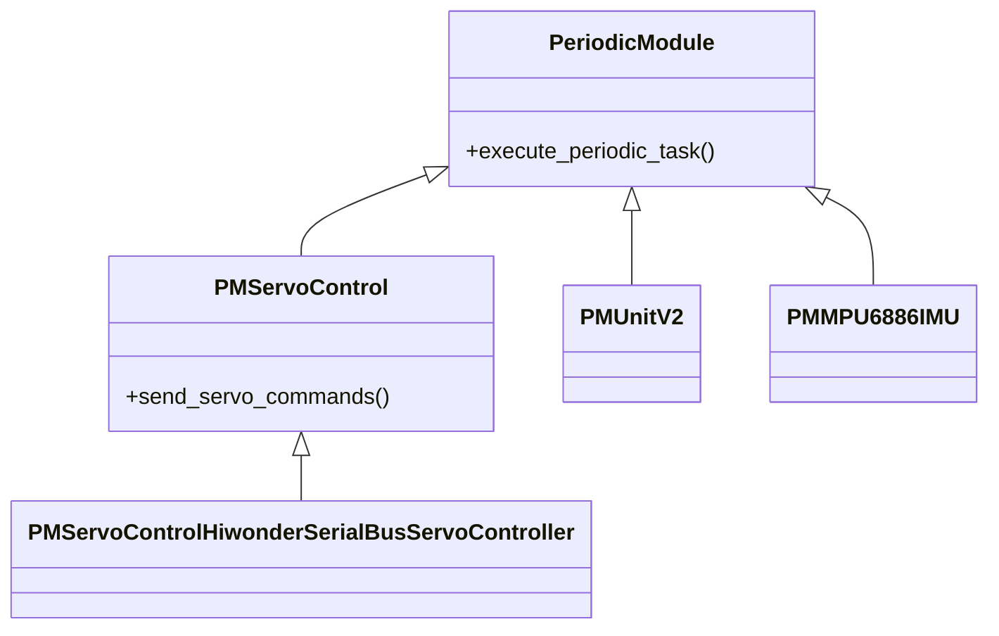
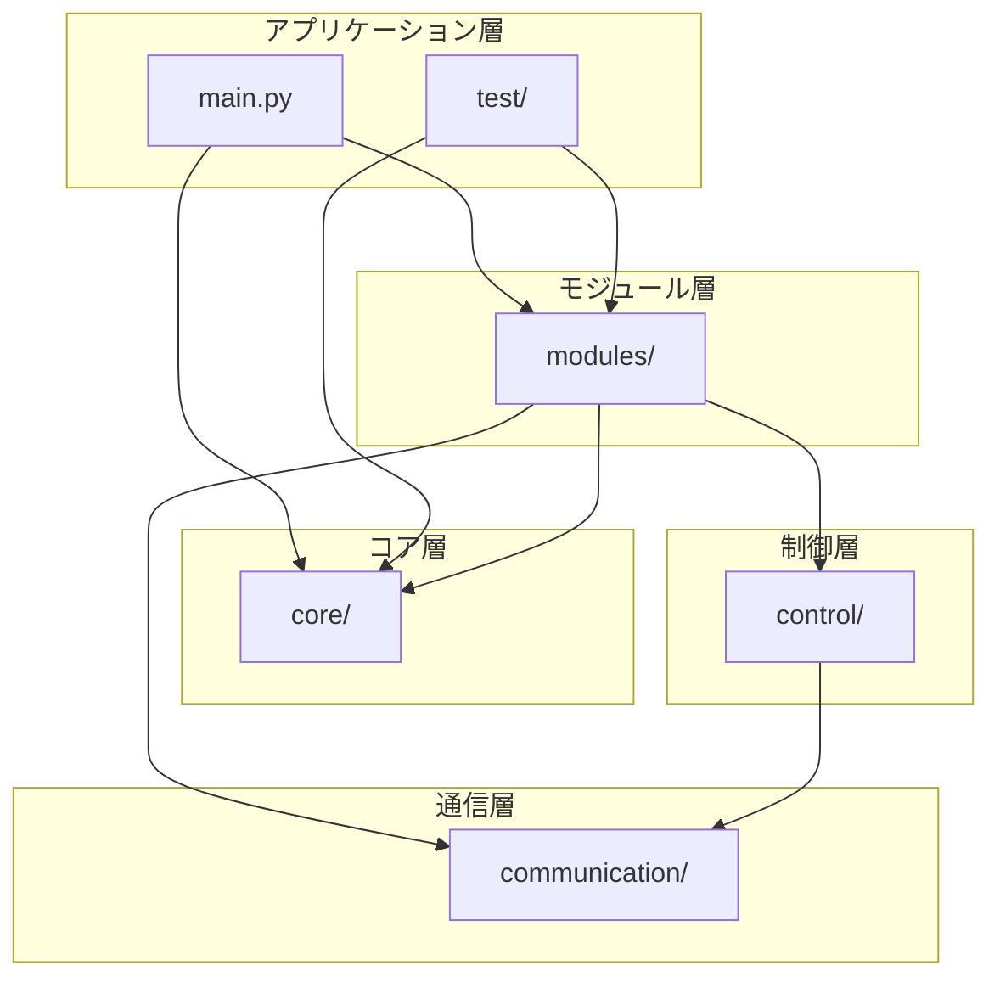

# 📁 4. リポジトリ構造

SOURプロジェクトのディレクトリ構成とファイル配置について説明します。

---

## 📂 ディレクトリツリー

```
SOUR/
├── docs_inst.md                    # ドキュメント生成指示書
├── main.py                         # メインエントリーポイント
├── README.md                       # プロジェクト概要
│
├── src/                           # ソースコードディレクトリ
│   ├── __init__.py
│   │
│   ├── core/                      # コアコンポーネント
│   │   ├── __init__.py
│   │   ├── async_module.py        # 非同期モジュール基底クラス
│   │   ├── periodic_module.py     # 定期実行モジュール基底クラス
│   │   ├── robot_core.py          # ロボット制御のコア
│   │   └── robot_properties.py    # ロボット特性定義
│   │
│   ├── modules/                   # 標準モジュール
│   │   ├── __init__.py
│   │   ├── pm_servo_control.py                                      # サーボ制御基底
│   │   ├── pm_servo_control_hiwonder_serial_bus_servo_controller.py # Hiwonderサーボ制御
│   │   ├── pm_unitv2.py                                             # UnitV2カメラ
│   │   └── pm_mpu6886_imu.py                                        # IMUセンサー
│   │
│   ├── communication/             # 通信レイヤー
│   │   ├── __init__.py
│   │   ├── lobot_serial_communication.py    # Hiwonderサーボ通信
│   │   ├── unitv2_serial_communication.py   # UnitV2通信
│   │   ├── mpu6886.py                       # MPU6886通信
│   │   └── recieve_motion_lang.py           # 動作言語受信
│   │
│   ├── control/                   # 制御ロジック
│   │   └── motion_lang2motor.py   # 動作言語→モータ変換
│   │
│   └── test/                      # テスト・デモ
│       ├── __init__.py
│       ├── pm_test_shiro.py       # Shiroテスト
│       ├── pm_demo_shiro.py       # Shiroデモ
│       ├── pm_demo_betty.py       # Bettyデモ
│       ├── motion_lang_test_shiro.py  # 動作言語テスト
│       └── motion.py              # モーション定義
│
└── wiki/                          # ドキュメント (本ディレクトリ)
    ├── 00-目次.md
    ├── 01-概要.md
    ├── 02-クイックスタート.md
    └── ...
```

---

## 📦 主要ディレクトリの説明

### `src/core/` - コアコンポーネント

SOURの中核となるクラス群です。すべてのロボットアプリケーションで使用します。

| ファイル | 説明 | 主要クラス |
|---------|------|-----------|
| [robot_core.py](../src/core/robot_core.py) | モジュール管理と実行制御 | `RobotCore` |
| [periodic_module.py](../src/core/periodic_module.py) | 定期実行モジュールの基底 | `PeriodicModule` |
| [robot_properties.py](../src/core/robot_properties.py) | ロボット特性の定義 | `RobotProperties`, `ServoEasingFunctions` |
| [async_module.py](../src/core/async_module.py) | 非同期モジュールの基底（現在未使用） | `AsyncModule` |

**依存関係**:


### `src/modules/` - 標準モジュール

すぐに使える実装済みモジュール群です。これらを参考にカスタムモジュールを作成できます。

| ファイル | 説明 | 対応ハードウェア |
|---------|------|----------------|
| [pm_servo_control.py](../src/modules/pm_servo_control.py) | サーボ制御基底クラス | 汎用 (デバッグ出力のみ) |
| [pm_servo_control_hiwonder_serial_bus_servo_controller.py](../src/modules/pm_servo_control_hiwonder_serial_bus_servo_controller.py) | Hiwonderサーボ実装 | Hiwonder Serial Bus Servo |
| [pm_unitv2.py](../src/modules/pm_unitv2.py) | AIカメラモジュール | M5Stack UnitV2 |
| [pm_mpu6886_imu.py](../src/modules/pm_mpu6886_imu.py) | IMUセンサーモジュール | MPU6886 |

**継承関係**:


### `src/communication/` - 通信レイヤー

ハードウェアとの低レベル通信を担当します。

| ファイル | 説明 | プロトコル |
|---------|------|-----------|
| [lobot_serial_communication.py](../src/communication/lobot_serial_communication.py) | Hiwonderサーボ通信 | シリアル (独自プロトコル) |
| [unitv2_serial_communication.py](../src/communication/unitv2_serial_communication.py) | UnitV2通信 | シリアル (JSON) |
| [mpu6886.py](../src/communication/mpu6886.py) | MPU6886通信 | I2C |
| [recieve_motion_lang.py](../src/communication/recieve_motion_lang.py) | 動作言語受信 | UDP |

### `src/control/` - 制御ロジック

高レベルの制御アルゴリズムを実装します。

| ファイル | 説明 |
|---------|------|
| [motion_lang2motor.py](../src/control/motion_lang2motor.py) | 動作言語をサーボコマンドに変換 |

### `src/test/` - テスト・デモ

実際のロボット実装例とテストコードです。

| ファイル | 説明 | ロボット |
|---------|------|---------|
| [pm_demo_shiro.py](../src/test/pm_demo_shiro.py) | Shiroロボットデモ | Shiro (14軸) |
| [pm_demo_betty.py](../src/test/pm_demo_betty.py) | Bettyロボットデモ | Betty (4軸) |
| [pm_test_shiro.py](../src/test/pm_test_shiro.py) | Shiroテストモジュール | Shiro |
| [motion_lang_test_shiro.py](../src/test/motion_lang_test_shiro.py) | 動作言語テスト | Shiro |
| [motion.py](../src/test/motion.py) | モーション定義 | - |

---

## 📄 ルートファイルの説明

### `main.py`

プログラムのエントリーポイントです。ここでロボットの設定とモジュールの登録を行います。

```python
from src.core.robot_core import RobotCore
from src.core.robot_properties import RobotProperties

def main():
    # 1. RobotPropertiesの設定
    robot_properties = RobotProperties()
    # ... 設定値の記述 ...
    
    # 2. RobotCoreの作成
    r_core = RobotCore(robot_properties)
    
    # 3. モジュールの登録
    r_core.register_module(...)
    
    # 4. 実行
    r_core.run()

if __name__ == "__main__":
    main()
```

参照: [../main.py](../main.py:1-68)

### `README.md`

プロジェクトの概要とクイックスタートガイドが記載されています。

参照: [../README.md](../README.md)

### `docs_inst.md`

このWikiを生成するための指示書です。

---

## 🔍 ファイル配置の規則

### モジュール命名規則

| プレフィックス | 意味 | 例 |
|--------------|------|-----|
| `PM` | PeriodicModule | `PMServoControl` |
| `AM` | AsyncModule | (将来の拡張用) |

### ファイル命名規則

- **小文字 + アンダースコア**: Pythonの標準スタイルに従う
  - 例: `robot_core.py`, `periodic_module.py`
- **説明的な名前**: ファイルの役割が明確にわかる名前
  - 良い例: `pm_servo_control_hiwonder_serial_bus_servo_controller.py`
  - 悪い例: `servo.py`, `module1.py`

---

## 🧩 モジュール間の依存関係



### 依存の方向

- ✅ 上位層から下位層への依存: OK
- ❌ 下位層から上位層への依存: 避けるべき

---

## 🎯 新しいファイルを追加する場所

### 新しいモジュールを作る場合

```
src/modules/pm_my_sensor.py
```

基本テンプレート:
```python
from src.core.periodic_module import PeriodicModule

class PMMySensor(PeriodicModule):
    def __init__(self, robot_properties, interval_ms=100):
        super().__init__(interval_ms)
        # 初期化処理
    
    def execute_periodic_task(self, lock, data_dict):
        super().execute_periodic_task(lock, data_dict)
        # 定期処理
```

### 新しい通信クラスを作る場合

```
src/communication/my_device_communication.py
```

### 新しいロボット実装を作る場合

```
src/test/pm_demo_my_robot.py
```

---

## 🗂️ `__pycache__/` について

Pythonが自動生成するバイトコードキャッシュです。

- **役割**: 実行速度の向上
- **Git管理**: `.gitignore`で除外推奨
- **削除**: 安全に削除可能 (再実行時に自動生成)

削除コマンド:
```bash
find . -type d -name __pycache__ -exec rm -r {} +
```

---

## 📚 次のステップ

- 各コアクラスの詳細 → [コアコンポーネント](./05-コアコンポーネント.md)
- モジュールの使い方 → [モジュール解説](./06-モジュール解説.md)
- 実装例を見る → [サンプル実装](./08-サンプル実装.md)

---

**参考**:
- プロジェクトルート: [..](../)
- ソースコード: [../src](../src)
