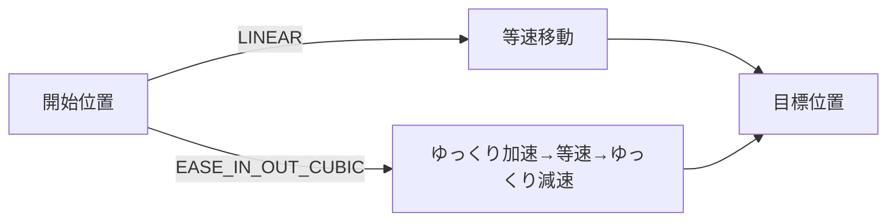
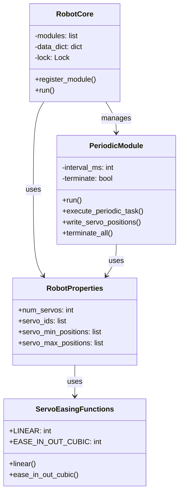

# ⚙️ 5. コアコンポーネント

SOURのコアコンポーネントについて詳しく解説します。これらはフレームワークの基盤となるクラス群です。

---

## 🎯 コアコンポーネント一覧

| コンポーネント | 役割 | ファイル |
|--------------|------|---------|
| `RobotCore` | モジュール管理・実行制御 | [robot_core.py](../src/core/robot_core.py) |
| `PeriodicModule` | 定期実行モジュール基底クラス | [periodic_module.py](../src/core/periodic_module.py) |
| `RobotProperties` | ロボット特性定義 | [robot_properties.py](../src/core/robot_properties.py) |
| `AsyncModule` | 非同期モジュール基底クラス（未実装） | [async_module.py](../src/core/async_module.py) |
| `ServoEasingFunctions` | イージング関数 | [robot_properties.py](../src/core/robot_properties.py) |

---

## 🤖 RobotCore

### 概要

`RobotCore`はSOURの中核となるクラスで、すべてのモジュールの実行を管理します。

### 主要な責務

1. **モジュール管理**: PeriodicModuleとAsyncModuleの登録
2. **共有メモリ管理**: `data_dict`の作成と管理
3. **プロセス制御**: 各モジュールをマルチプロセスとして実行
4. **排他制御**: ロック機構の提供

### クラス定義

```python
class RobotCore:
    def __init__(self, robot_properties):
        """
        Parameters
        ----------
        robot_properties : RobotProperties
            ロボットの特性を定義したオブジェクト
        
        Attributes
        ----------
        modules : list
            登録されたPeriodicModuleのリスト
        async_modules : list
            登録されたAsyncModuleのリスト
        manager : multiprocessing.Manager
            共有メモリ管理用マネージャー
        lock : multiprocessing.Lock
            排他制御用ロック
        data_dict : multiprocessing.Manager().dict()
            プロセス間データ共有用辞書
        """
```

参照: [../src/core/robot_core.py](../src/core/robot_core.py:6-40)

### 主要メソッド

#### `__init__(robot_properties)`

RobotCoreを初期化します。

```python
def __init__(self, robot_properties):
    self.modules = []
    self.async_modules = []
    
    # 共有メモリの設定
    self.manager = multiprocessing.Manager()
    self.lock = multiprocessing.Lock()
    self.data_dict = self.manager.dict()
    
    # サーボ制御用のデータ構造を初期化
    num_servos = robot_properties.num_servos
    self.data_dict['servo_target_positions'] = [0.0] * num_servos
    self.data_dict['servo_operation_times'] = [0.0] * num_servos
    self.data_dict['servo_params_updated'] = False
    self.data_dict['servo_ready'] = True
    self.data_dict['terminate'] = False
```

#### `register_module(module)`

PeriodicModuleを登録します。

```python
def register_module(self, module):
    """
    Parameters
    ----------
    module : PeriodicModule
        登録するモジュール
    
    Raises
    ------
    AssertionError
        moduleがPeriodicModuleのインスタンスでない場合
    """
    assert isinstance(module, PeriodicModule)
    self.modules.append(module)
```

参照: [../src/core/robot_core.py](../src/core/robot_core.py:54-66)

#### `register_async_module(module)`

AsyncModuleを登録します（将来の拡張用）。

```python
def register_async_module(self, module):
    assert isinstance(module, AsyncModule)
    self.async_modules.append(module)
```

#### `run()`

登録されたすべてのモジュールを並列実行します。

```python
def run(self):
    """
    登録されたすべてのPeriodicModuleを並列実行
    
    各モジュールを独立したプロセスとして起動し、
    すべてのプロセスが終了するまで待機します。
    """
    processes = []
    
    # 各モジュールをプロセスとして起動
    for module in self.modules:
        process = multiprocessing.Process(
            target=module.run, 
            args=(self.lock, self.data_dict,)
        )
        processes.append(process)
        process.start()
    
    # すべてのプロセスが終了するまで待機
    for process in processes:
        process.join()
```

参照: [../src/core/robot_core.py](../src/core/robot_core.py:89-110)

### 使用例

```python
from src.core.robot_core import RobotCore
from src.core.robot_properties import RobotProperties
from src.modules.pm_servo_control import PMServoControl

# 1. RobotPropertiesを設定
props = RobotProperties()
props.num_servos = 4

# 2. RobotCoreを作成
core = RobotCore(props)

# 3. モジュールを登録
core.register_module(PMServoControl(props, 50))

# 4. 実行
core.run()
```

---

## 🔄 PeriodicModule

### 概要

定期的に実行される処理を記述するための基底クラスです。すべてのカスタムモジュールはこのクラスを継承します。

### クラス定義

```python
class PeriodicModule:
    def __init__(self, interval_ms=1000):
        """
        Parameters
        ----------
        interval_ms : int
            実行間隔 (ミリ秒)
        
        Attributes
        ----------
        interval_ms : int
            実行間隔
        terminate : bool
            終了フラグ
        """
        self.interval_ms = interval_ms
        self.terminate = False
```

参照: [../src/core/periodic_module.py](../src/core/periodic_module.py:1-8)

### 主要メソッド

#### `run(lock, data_dict)`

定期実行のメインループです。通常はオーバーライドしません。

```python
def run(self, lock, data_dict):
    """
    指定間隔でexecute_periodic_taskを実行
    
    Parameters
    ----------
    lock : multiprocessing.Lock
        共有メモリアクセス用ロック
    data_dict : multiprocessing.Manager().dict()
        プロセス間共有データ
    """
    time0 = time.perf_counter()
    
    while not self.terminate:
        time1 = time.perf_counter()
        
        # 指定間隔が経過したか確認
        if (time1 - time0) * 1000 > self.interval_ms:
            time0 = time1
            self.execute_periodic_task(lock, data_dict)
```

参照: [../src/core/periodic_module.py](../src/core/periodic_module.py:11-29)

#### `execute_periodic_task(lock, data_dict)` ⭐

**このメソッドをオーバーライドして実装します。**

```python
def execute_periodic_task(self, lock, data_dict):
    """
    定期的に実行される処理
    
    サブクラスでこのメソッドをオーバーライドして、
    実際の処理を記述します。
    
    Parameters
    ----------
    lock : multiprocessing.Lock
        共有メモリアクセス用ロック
    data_dict : multiprocessing.Manager().dict()
        プロセス間共有データ
    """
    # 終了フラグをチェック
    if data_dict['terminate'] == True:
        self.terminate = True
```

参照: [../src/core/periodic_module.py](../src/core/periodic_module.py:32-49)

#### `write_servo_positions(lock, data_dict, servo_positions, servo_operation_times)`

サーボ位置を共有メモリに書き込むヘルパーメソッドです。

```python
def write_servo_positions(self, lock, data_dict, servo_positions, servo_operation_times):
    """
    Parameters
    ----------
    lock : multiprocessing.Lock
        共有メモリアクセス用ロック
    data_dict : dict
        共有メモリ辞書
    servo_positions : list[float]
        サーボ目標位置のリスト
    servo_operation_times : list[float]
        各サーボの動作時間 (ミリ秒) のリスト
    """
    with lock:
        data_dict['servo_target_positions'] = servo_positions
        data_dict['servo_operation_times'] = servo_operation_times
        data_dict['servo_params_updated'] = True
```

参照: [../src/core/periodic_module.py](../src/core/periodic_module.py:52-67)

#### `terminate_all(lock, data_dict)`

すべてのモジュールを終了させます。

```python
def terminate_all(self, lock, data_dict):
    """
    すべてのPeriodicModuleを終了
    
    このメソッドを呼び出すと、data_dict['terminate']がTrueになり、
    すべてのモジュールが終了します。
    """
    with lock:
        data_dict['terminate'] = True
```

参照: [../src/core/periodic_module.py](../src/core/periodic_module.py:70-82)

### 使用例

```python
from src.core.periodic_module import PeriodicModule

class MyModule(PeriodicModule):
    def __init__(self, robot_properties, interval_ms=1000):
        super().__init__(interval_ms)
        self.counter = 0
    
    def execute_periodic_task(self, lock, data_dict):
        # 必ず親クラスのメソッドを呼ぶ (終了フラグチェック)
        super().execute_periodic_task(lock, data_dict)
        
        # 実際の処理
        self.counter += 1
        print(f"Counter: {self.counter}")
        
        # 10回実行したら終了
        if self.counter >= 10:
            self.terminate_all(lock, data_dict)
```

---

## 📋 RobotProperties

### 概要

ロボットの物理的特性やハードウェア設定を管理するクラスです。

### クラス定義

```python
class RobotProperties:
    def __init__(self):
        # サーボモータ関連
        self.num_servos = 0                    # サーボの個数
        self.servo_ids = []                    # サーボIDのリスト
        self.servo_min_positions = []          # 最小位置 (PWM値)
        self.servo_max_positions = []          # 最大位置 (PWM値)
        self.servo_shifts = []                 # 位置補正値
        self.servo_initial_positions = []      # 初期位置
        
        # イージング関数
        self.servo_easing_function = ServoEasingFunctions.LINEAR
        
        # 通信ポート
        self.servo_controller_port = '/dev/ttyAMA0'
        self.camera_port = '/dev/ttyAMA0'
```

参照: [../src/core/robot_properties.py](../src/core/robot_properties.py:1-11)

### プロパティ詳細

| プロパティ | 型 | 説明 |
|-----------|-----|------|
| `num_servos` | int | サーボモータの個数 |
| `servo_ids` | list[int] | サーボIDのリスト |
| `servo_min_positions` | list[float] | 各サーボの最小位置 (PWM値) |
| `servo_max_positions` | list[float] | 各サーボの最大位置 (PWM値) |
| `servo_shifts` | list[float] | 初期位置のずれ補正値 |
| `servo_initial_positions` | list[float] | サーボの初期位置 |
| `servo_easing_function` | int | イージング関数の種類 |
| `servo_controller_port` | str | サーボコントローラの通信ポート |
| `camera_port` | str | カメラの通信ポート |

### 使用例

```python
from src.core.robot_properties import RobotProperties, ServoEasingFunctions

props = RobotProperties()

# サーボ設定
props.num_servos = 4
props.servo_ids = [0, 1, 2, 3]
props.servo_min_positions = [500.0, 500.0, 500.0, 500.0]
props.servo_max_positions = [2500.0, 2500.0, 2500.0, 2500.0]
props.servo_initial_positions = [1500.0, 1500.0, 1500.0, 1500.0]
props.servo_shifts = [0.0, 0.0, 0.0, 0.0]

# イージング設定
props.servo_easing_function = ServoEasingFunctions.EASE_IN_OUT_CUBIC

# 通信ポート設定
props.servo_controller_port = '/dev/ttyAMA2'
props.camera_port = '/dev/ttyAMA4'
```

---

## 📐 ServoEasingFunctions

### 概要

サーボモータの動きを滑らかにするイージング関数を提供します。

### 定数

| 定数 | 値 | 説明 |
|------|-----|------|
| `LINEAR` | 0 | 線形補間 (等速運動) |
| `EASE_IN_OUT_CUBIC` | 1 | 3次イージング (滑らかな加減速) |

### メソッド

#### `linear(x)`

線形補間: $f(x) = x$

```python
@staticmethod
def linear(x):
    return x
```

#### `ease_in_out_cubic(x)`

3次イージング:

$$
f(x) = \begin{cases}
4x^3 & (x < 0.5) \\
1 - \frac{(-2x + 2)^3}{2} & (x \geq 0.5)
\end{cases}
$$


```python
@staticmethod
def ease_in_out_cubic(x):
    if x < 0.5:
        return 4 * x * x * x
    else:
        return 1 - pow(-2 * x + 2, 3) / 2
```

参照: [../src/core/robot_properties.py](../src/core/robot_properties.py:14-30)

### イージングの効果



---

## 🔮 AsyncModule

### 概要

非同期実行モジュールの基底クラスです。現在は基本実装のみで、将来の拡張用に用意されています。

```python
class AsyncModule:
    def __init__(self):
        pass
```

参照: [../src/core/async_module.py](../src/core/async_module.py:1-3)

---

## 🎨 コンポーネント間の関係



---

## 📚 次のステップ

- 具体的なモジュール実装を学ぶ → [モジュール解説](./06-モジュール解説.md)
- 通信の仕組みを理解する → [通信インターフェース](./07-通信インターフェース.md)
- 実際のロボットを見る → [サンプル実装](./08-サンプル実装.md)

---

**参考ファイル**:
- [../src/core/robot_core.py](../src/core/robot_core.py) - RobotCoreの完全な実装
- [../src/core/periodic_module.py](../src/core/periodic_module.py) - PeriodicModuleの完全な実装
- [../src/core/robot_properties.py](../src/core/robot_properties.py) - RobotPropertiesの完全な実装
