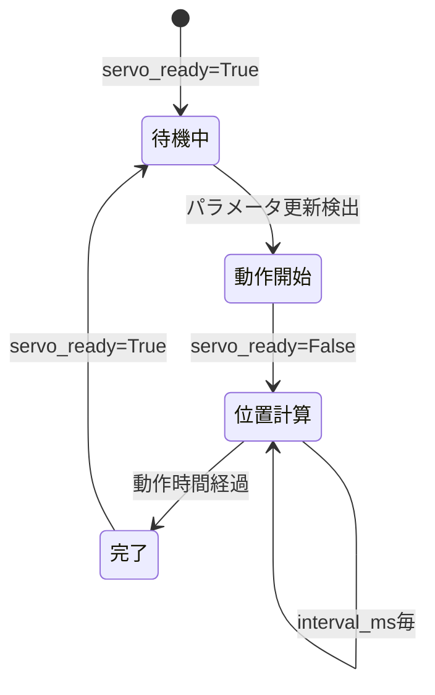

# 🔧 6. モジュール解説

SOURに含まれる標準モジュールと、カスタムモジュールの作成方法について解説します。

---

## 📦 標準モジュール一覧

| モジュール | 機能 | 対応ハードウェア |
|----------|------|----------------|
| `PMServoControl` | サーボ制御基底クラス | 汎用 (デバッグ出力) |
| `PMServoControlHiwonderSerialBusServoController` | Hiwonderサーボ制御 | Hiwonder Serial Bus Servo |
| `PMUnitV2` | AIカメラ連携 | M5Stack UnitV2 |
| `PMMPU6886IMU` | IMUセンサー | MPU6886 |

---

## 🎮 PMServoControl

### 概要

サーボモータ制御の基底クラスです。サーボの位置計算、イージング処理、タイミング制御を担当します。

実際のハードウェア通信は`send_servo_commands()`メソッドをオーバーライドして実装します。

### クラス構造

```python
class PMServoControl(PeriodicModule):
    def __init__(self, robot_properties, interval_ms=1000):
        super().__init__(interval_ms)
        
        # サーボ情報のコピー
        self.servo_ids = copy.deepcopy(robot_properties.servo_ids)
        self.servo_max_positions = copy.deepcopy(robot_properties.servo_max_positions)
        self.servo_min_positions = copy.deepcopy(robot_properties.servo_min_positions)
        self.servo_shifts = copy.deepcopy(robot_properties.servo_shifts)
        self.servo_easing_function = robot_properties.servo_easing_function
        
        # 制御パラメータ
        self.all_servos_operated = True
        self.servo_operation_start_time = 0
        self.servo_target_positions = [0.0] * len(self.servo_ids)
        self.servo_operation_times = [0.0] * len(self.servo_ids)
        
        # 位置情報
        self.servo_prev_positions = copy.deepcopy(robot_properties.servo_initial_positions)
        self.servo_next_positions = copy.deepcopy(robot_properties.servo_initial_positions)
```

参照: [../src/modules/pm_servo_control.py](../src/modules/pm_servo_control.py:7-28)

### 主要メソッド

#### `send_servo_commands(next_positions)`

サーボコマンドを送信します。**サブクラスでオーバーライドして実装**します。

```python
def send_servo_commands(self, next_positions):
    """
    サーボコマンドを送信 (デバッグ用実装)
    
    Parameters
    ----------
    next_positions : list[float]
        各サーボの目標位置
    """
    print("command:" + str(next_positions))
```

デバッグ時はこのクラスを直接使用すると、ハードウェアなしで動作確認できます。

#### `execute_periodic_task(lock, data_dict)`

定期実行される処理です。以下の処理を行います:

1. **パラメータ更新の検出**
```python
servo_params_updated = data_dict['servo_params_updated']
if servo_params_updated == True:
    self.all_servos_operated = False
    self.servo_operation_start_time = time.perf_counter()
    self.servo_prev_positions = copy.deepcopy(self.servo_next_positions)
    self.servo_target_positions = copy.deepcopy(data_dict['servo_target_positions'])
    self.servo_operation_times = copy.deepcopy(data_dict['servo_operation_times'])
    
    with lock:
        data_dict['servo_params_updated'] = False
        data_dict['servo_ready'] = False
```

2. **位置計算とイージング適用**
```python
if self.all_servos_operated == False:
    current_time = time.perf_counter()
    op_elapsed_time = (current_time - self.servo_operation_start_time) * 1000
    
    for i in range(len(self.servo_ids)):
        servo_target_position = self.servo_target_positions[i] + self.servo_shifts[i]
        servo_operation_time = self.servo_operation_times[i]
        servo_prev_position = self.servo_prev_positions[i]
        
        # 動作進行率を計算 (0.0 ~ 1.0)
        op_ratio = min(max(0.0, op_elapsed_time / servo_operation_time), 1.0)
        
        # イージング関数を適用
        if self.servo_easing_function == ServoEasingFunctions.LINEAR:
            op_ratio = ServoEasingFunctions.linear(op_ratio)
        elif self.servo_easing_function == ServoEasingFunctions.EASE_IN_OUT_CUBIC:
            op_ratio = ServoEasingFunctions.ease_in_out_cubic(op_ratio)
        
        # 現在位置を計算
        servo_position = servo_prev_position + (servo_target_position - servo_prev_position) * op_ratio
        
        # 範囲制限
        servo_position = min(max(servo_position, servo_min_position), servo_max_position)
        
        self.servo_next_positions[i] = servo_position
```

3. **サーボコマンド送信と完了判定**
```python
    # サーボコマンドを送信
    self.send_servo_commands(self.servo_next_positions)
    
    # すべてのサーボが動作完了したか確認
    if op_elapsed_time >= max(self.servo_operation_times):
        self.all_servos_operated = True
        with lock:
            data_dict['servo_ready'] = True
```

参照: [../src/modules/pm_servo_control.py](../src/modules/pm_servo_control.py:36-100)

### 動作フロー



### 使用例

```python
from src.core.robot_core import RobotCore
from src.core.robot_properties import RobotProperties
from src.modules.pm_servo_control import PMServoControl

props = RobotProperties()
props.num_servos = 4
props.servo_ids = [0, 1, 2, 3]

core = RobotCore(props)
# デバッグ用 (コンソールに出力)
core.register_module(PMServoControl(props, 50))
core.run()
```

---

## 🤖 PMServoControlHiwonderSerialBusServoController

### 概要

Hiwonder Serial Bus Servo Controllerに対応したサーボ制御モジュールです。`PMServoControl`を継承し、`send_servo_commands()`を実装しています。

### クラス構造

```python
class PMServoControlHiwonderSerialBusServoController(PMServoControl):
    def __init__(self, robot_properties, interval_ms=1000):
        super().__init__(robot_properties, interval_ms)
        
        # Lobotサーボコントローラを初期化
        self.lsc = LobotServoController(port=robot_properties.servo_controller_port)
        
        # 接続確認
        if not self.lsc.connect():
            raise ConnectionError("Failed to connect to servo controller")
```

参照: [../src/modules/pm_servo_control_hiwonder_serial_bus_servo_controller.py](../src/modules/pm_servo_control_hiwonder_serial_bus_servo_controller.py:1-11)

### オーバーライドメソッド

#### `send_servo_commands(next_positions)`

```python
def send_servo_commands(self, next_positions):
    """
    Hiwonderサーボコントローラにコマンドを送信
    
    Parameters
    ----------
    next_positions : list[float]
        各サーボの目標位置
    """
    command = []
    for i in range(len(self.servo_ids)):
        command.append((self.servo_ids[i], int(next_positions[i])))
    
    # 10ms以内に移動完了
    self.lsc.moveServos(command, 10)
```

### 使用例

```python
from src.modules.pm_servo_control_hiwonder_serial_bus_servo_controller import PMServoControlHiwonderSerialBusServoController

props = RobotProperties()
props.num_servos = 14
props.servo_ids = [2, 3, 4, 5, 6, 7, 8, 9, 10, 11, 12, 13, 14, 15]
props.servo_controller_port = '/dev/ttyAMA2'

core = RobotCore(props)
core.register_module(PMServoControlHiwonderSerialBusServoController(props, 50))
```

---

## 📷 PMUnitV2

### 概要

M5Stack UnitV2 AIカメラからデータを受信するモジュールです。

### クラス構造

```python
class PMUnitV2(PeriodicModule):
    def __init__(self, robot_properties, interval_ms=1000):
        super().__init__(interval_ms)
        
        # UnitV2通信オブジェクトを作成
        self.unitv2 = UnitV2SerialCommunication(port=robot_properties.camera_port)
        
        # 接続確認
        if not self.unitv2.connect():
            raise ConnectionError("Failed to connect to unitv2")
        
        self.json_message = ""
```

参照: [../src/modules/pm_unitv2.py](../src/modules/pm_unitv2.py:1-16)

### 主要メソッド

#### `read_data()`

UnitV2からJSONデータを受信します。

```python
def read_data(self):
    self.json_message = self.unitv2.receive_data()
    print(self.json_message)
```

#### `execute_periodic_task(lock, data_dict)`

定期的にデータを読み取ります。

```python
def execute_periodic_task(self, lock, data_dict):
    super().execute_periodic_task(lock, data_dict)
    self.read_data()
```

### 拡張例

データをdata_dictに保存する場合:

```python
def execute_periodic_task(self, lock, data_dict):
    super().execute_periodic_task(lock, data_dict)
    
    self.json_message = self.unitv2.receive_data()
    
    if self.json_message:
        with lock:
            data_dict['camera_data'] = self.json_message
```

---

## 📏 PMMPU6886IMU

### 概要

MPU6886 IMUセンサーから加速度・ジャイロ・温度データを取得するモジュールです。

### クラス構造

```python
class PMMPU6886IMU(PeriodicModule):
    def __init__(self, robot_properties, interval_ms=1000):
        super().__init__(interval_ms)
        
        # MPU6886を初期化
        self.mpu6886 = MPU6886()
        self.mpu6886.initialize()
```

参照: [../src/modules/pm_mpu6886_imu.py](../src/modules/pm_mpu6886_imu.py:1-9)

### 主要メソッド

#### `execute_periodic_task(lock, data_dict)`

センサーデータを取得し、表示します。

```python
def execute_periodic_task(self, lock, data_dict):
    super().execute_periodic_task(lock, data_dict)
    
    # データ取得
    gx, gy, gz = self.mpu6886.get_gyro_data()      # ジャイロ
    ax, ay, az = self.mpu6886.get_accel_data()     # 加速度
    temp = self.mpu6886.get_temp_data()            # 温度
    
    print(f"gx: {gx}, gy: {gy}, gz: {gz}, ax: {ax}, ay: {ay}, az: {az}, temp: {temp}")
```

### 拡張例 (data_dictへの保存)

コメントアウトされたコードを有効化することで、data_dictにデータを保存できます:

```python
def execute_periodic_task(self, lock, data_dict):
    super().execute_periodic_task(lock, data_dict)
    
    gx, gy, gz = self.mpu6886.get_gyro_data()
    ax, ay, az = self.mpu6886.get_accel_data()
    temp = self.mpu6886.get_temp_data()
    
    # 共有メモリに保存
    with lock:
        data_dict['gx'] = gx
        data_dict['gy'] = gy
        data_dict['gz'] = gz
        data_dict['ax'] = ax
        data_dict['ay'] = ay
        data_dict['az'] = az
        data_dict['temp'] = temp
```

参照: [../src/modules/pm_mpu6886_imu.py](../src/modules/pm_mpu6886_imu.py:12-30)

---

## 🛠️ カスタムモジュールの作成

### 基本テンプレート

```python
from src.core.periodic_module import PeriodicModule

class MyCustomModule(PeriodicModule):
    def __init__(self, robot_properties, interval_ms=1000):
        """
        初期化処理
        
        Parameters
        ----------
        robot_properties : RobotProperties
            ロボット特性
        interval_ms : int
            実行間隔 (ミリ秒)
        """
        super().__init__(interval_ms)
        
        # モジュール固有の初期化
        self.my_variable = 0
    
    def execute_periodic_task(self, lock, data_dict):
        """
        定期実行される処理
        
        Parameters
        ----------
        lock : multiprocessing.Lock
            排他制御用ロック
        data_dict : dict
            共有メモリ辞書
        """
        # 必ず親クラスのメソッドを呼ぶ
        super().execute_periodic_task(lock, data_dict)
        
        # 実際の処理を記述
        self.my_variable += 1
        
        # 共有メモリへの書き込み
        with lock:
            data_dict['my_data'] = self.my_variable
```

### センサーモジュールのテンプレート

```python
from src.core.periodic_module import PeriodicModule
from my_sensor_library import MySensor

class PMMyCustomSensor(PeriodicModule):
    def __init__(self, robot_properties, interval_ms=100):
        super().__init__(interval_ms)
        
        # センサー初期化
        self.sensor = MySensor()
        self.sensor.initialize()
    
    def execute_periodic_task(self, lock, data_dict):
        super().execute_periodic_task(lock, data_dict)
        
        # センサーデータ取得
        sensor_value = self.sensor.read()
        
        # 共有メモリに保存
        with lock:
            data_dict['sensor_value'] = sensor_value
        
        print(f"Sensor: {sensor_value}")
```

### アクチュエータモジュールのテンプレート

```python
from src.core.periodic_module import PeriodicModule

class PMMyActuator(PeriodicModule):
    def __init__(self, robot_properties, interval_ms=50):
        super().__init__(interval_ms)
        
        # アクチュエータ初期化
        self.actuator = MyActuator()
    
    def execute_periodic_task(self, lock, data_dict):
        super().execute_periodic_task(lock, data_dict)
        
        # 共有メモリから制御値を取得
        if 'actuator_command' in data_dict:
            command = data_dict['actuator_command']
            
            # アクチュエータを制御
            self.actuator.set(command)
```

---

## 📊 モジュール設計のベストプラクティス

### 1. 適切な実行間隔の設定

| 用途 | 推奨間隔 |
|------|---------|
| サーボ制御 | 20-50ms |
| センサー読取 | 50-100ms |
| 意思決定 | 100-1000ms |

### 2. ロックの最小化

```python
# ✅ 良い例
value = expensive_calculation()
with lock:
    data_dict['result'] = value

# ❌ 悪い例
with lock:
    value = expensive_calculation()  # ロック中に重い処理
    data_dict['result'] = value
```

### 3. エラーハンドリング

```python
def execute_periodic_task(self, lock, data_dict):
    super().execute_periodic_task(lock, data_dict)
    
    try:
        sensor_value = self.sensor.read()
        with lock:
            data_dict['sensor_value'] = sensor_value
    except Exception as e:
        print(f"Sensor read error: {e}")
        # エラー時の処理
```

---

## 📚 次のステップ

- 通信の詳細を学ぶ → [通信インターフェース](./07-通信インターフェース.md)
- 実装例を見る → [サンプル実装](./08-サンプル実装.md)
- 自分のモジュールを作る → [開発ガイド](./09-開発ガイド.md)

---

**参考ファイル**:
- [../src/modules/pm_servo_control.py](../src/modules/pm_servo_control.py) - サーボ制御基底クラス
- [../src/modules/pm_servo_control_hiwonder_serial_bus_servo_controller.py](../src/modules/pm_servo_control_hiwonder_serial_bus_servo_controller.py) - Hiwonder実装
- [../src/modules/pm_unitv2.py](../src/modules/pm_unitv2.py) - UnitV2モジュール
- [../src/modules/pm_mpu6886_imu.py](../src/modules/pm_mpu6886_imu.py) - IMUモジュール
