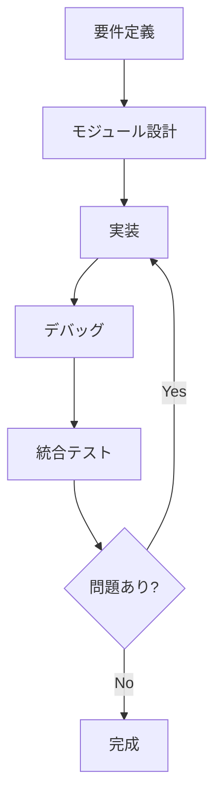

# 👨‍💻 9. 開発ガイド

SOURを使った開発のベストプラクティスと、新しいモジュールの作成方法を解説します。

---

## 🎯 開発の基本フロー



### Step 1: 要件定義

何を実装するか明確にします。

- **センサーモジュール**: どのデータを取得するか
- **アクチュエータモジュール**: どのように制御するか
- **制御モジュール**: どのようなロジックを実装するか

### Step 2: モジュール設計

- **実行間隔**: どのくらいの頻度で実行するか
- **データ共有**: 他のモジュールとどのようにデータをやり取りするか
- **依存関係**: 必要なライブラリやハードウェア

### Step 3-5: 実装・デバッグ・統合

具体的な手順は以下で説明します。

---

## 🛠️ 新しいモジュールの作成

### センサーモジュールの例

温度センサーから値を取得するモジュールを作成します。

#### 1. ファイル作成

```bash
# src/modules/配下に新しいファイルを作成
touch src/modules/pm_temperature_sensor.py
```

#### 2. 基本構造の実装

```python
from src.core.periodic_module import PeriodicModule
import random  # センサーライブラリの代わり

class PMTemperatureSensor(PeriodicModule):
    def __init__(self, robot_properties, interval_ms=1000):
        """
        温度センサーモジュール
        
        Parameters
        ----------
        robot_properties : RobotProperties
            ロボット特性 (今回は未使用)
        interval_ms : int
            実行間隔 (ミリ秒)
        """
        super().__init__(interval_ms)
        
        # センサー初期化 (仮想)
        self.sensor_initialized = True
        print("Temperature sensor initialized")
    
    def execute_periodic_task(self, lock, data_dict):
        """
        定期的に温度を読み取り、共有メモリに保存
        """
        # 親クラスのメソッドを呼ぶ (終了フラグチェック)
        super().execute_periodic_task(lock, data_dict)
        
        # センサーから温度を取得 (仮想的なデータ)
        temperature = self._read_temperature()
        
        # 共有メモリに保存
        with lock:
            data_dict['temperature'] = temperature
            data_dict['temperature_timestamp'] = time.time()
        
        print(f"Temperature: {temperature:.1f}°C")
    
    def _read_temperature(self):
        """
        センサーから温度を読み取る (仮想実装)
        
        実際の実装では、センサーライブラリを使用します。
        """
        # 20-30度のランダムな値を返す
        return 20.0 + random.random() * 10.0
```

#### 3. main.pyで登録

```python
from src.modules.pm_temperature_sensor import PMTemperatureSensor

# モジュールを登録
r_core.register_module(PMTemperatureSensor(robot_properties, 1000))
```

---

### アクチュエータモジュールの例

LED制御モジュールを作成します。

```python
from src.core.periodic_module import PeriodicModule
# import RPi.GPIO as GPIO  # 実際のハードウェア制御

class PMLEDController(PeriodicModule):
    def __init__(self, robot_properties, interval_ms=100, pin=18):
        super().__init__(interval_ms)
        
        self.pin = pin
        # GPIO.setmode(GPIO.BCM)
        # GPIO.setup(self.pin, GPIO.OUT)
        print(f"LED controller initialized on pin {self.pin}")
    
    def execute_periodic_task(self, lock, data_dict):
        super().execute_periodic_task(lock, data_dict)
        
        # 共有メモリからLED制御コマンドを取得
        if 'led_on' in data_dict:
            led_state = data_dict['led_on']
            self._set_led(led_state)
    
    def _set_led(self, state):
        """
        LEDを点灯/消灯
        
        Parameters
        ----------
        state : bool
            True: 点灯, False: 消灯
        """
        # GPIO.output(self.pin, GPIO.HIGH if state else GPIO.LOW)
        print(f"LED: {'ON' if state else 'OFF'}")
```

---

### 制御ロジックモジュールの例

温度に応じてファンを制御するモジュールを作成します。

```python
from src.core.periodic_module import PeriodicModule

class PMTemperatureController(PeriodicModule):
    def __init__(self, robot_properties, interval_ms=500):
        super().__init__(interval_ms)
        
        self.temp_threshold_high = 28.0  # 28度以上でファンON
        self.temp_threshold_low = 25.0   # 25度以下でファンOFF
    
    def execute_periodic_task(self, lock, data_dict):
        super().execute_periodic_task(lock, data_dict)
        
        # 温度センサーのデータを取得
        if 'temperature' in data_dict:
            temperature = data_dict['temperature']
            
            # 制御ロジック
            if temperature > self.temp_threshold_high:
                fan_on = True
            elif temperature < self.temp_threshold_low:
                fan_on = False
            else:
                # ヒステリシス: 現在の状態を維持
                fan_on = data_dict.get('fan_on', False)
            
            # 制御コマンドを共有メモリに書き込み
            with lock:
                data_dict['fan_on'] = fan_on
            
            print(f"Temp: {temperature:.1f}°C, Fan: {'ON' if fan_on else 'OFF'}")
```

---

## 🔍 デバッグテクニック

### 1. デバッグ出力

```python
def execute_periodic_task(self, lock, data_dict):
    super().execute_periodic_task(lock, data_dict)
    
    # デバッグ情報を出力
    print(f"[DEBUG] Module: {self.__class__.__name__}")
    print(f"[DEBUG] Timestamp: {time.time()}")
    print(f"[DEBUG] data_dict keys: {list(data_dict.keys())}")
    
    # 処理...
```

### 2. ドライラン (ハードウェアなし)

```python
class PMServoControlDryRun(PMServoControl):
    """
    ハードウェアなしで動作確認するためのサーボ制御
    """
    def send_servo_commands(self, next_positions):
        # 実際の通信は行わず、コンソールに出力
        print(f"[DRY RUN] Servo commands: {next_positions}")
```

### 3. 条件付きロギング

```python
class PMMyModule(PeriodicModule):
    def __init__(self, robot_properties, interval_ms=1000, debug=False):
        super().__init__(interval_ms)
        self.debug = debug
    
    def execute_periodic_task(self, lock, data_dict):
        super().execute_periodic_task(lock, data_dict)
        
        if self.debug:
            print(f"[MyModule] Executing at {time.time()}")
        
        # 処理...
```

### 4. 例外ハンドリング

```python
def execute_periodic_task(self, lock, data_dict):
    super().execute_periodic_task(lock, data_dict)
    
    try:
        # センサーからデータ取得
        value = self.sensor.read()
        
        with lock:
            data_dict['sensor_value'] = value
    
    except Exception as e:
        print(f"[ERROR] {self.__class__.__name__}: {e}")
        # エラー時のフォールバック処理
        with lock:
            data_dict['sensor_error'] = True
```

---

## 📊 パフォーマンス最適化

### 1. 適切な実行間隔の設定

```python
# ❌ 悪い例: すべて同じ間隔
sensor_module = PMSensor(props, 100)
control_module = PMControl(props, 100)
display_module = PMDisplay(props, 100)

# ✅ 良い例: 必要に応じて間隔を変える
sensor_module = PMSensor(props, 50)      # センサー: 高頻度
control_module = PMControl(props, 100)   # 制御: 中頻度
display_module = PMDisplay(props, 500)   # 表示: 低頻度
```

### 2. ロックの最小化

```python
# ❌ 悪い例: ロック内で重い処理
with lock:
    value = expensive_calculation()  # NG!
    data_dict['result'] = value

# ✅ 良い例: 事前に計算してから書き込み
value = expensive_calculation()
with lock:
    data_dict['result'] = value
```

### 3. 不要な処理のスキップ

```python
def execute_periodic_task(self, lock, data_dict):
    super().execute_periodic_task(lock, data_dict)
    
    # サーボが準備できていない場合はスキップ
    if not data_dict.get('servo_ready', False):
        return
    
    # 処理...
```

---

## 🧪 テスト戦略

### 1. ユニットテスト (個別モジュール)

```python
# test_my_module.py
from src.modules.pm_temperature_sensor import PMTemperatureSensor
from src.core.robot_properties import RobotProperties
import multiprocessing

def test_temperature_sensor():
    props = RobotProperties()
    sensor = PMTemperatureSensor(props, 1000)
    
    manager = multiprocessing.Manager()
    lock = multiprocessing.Lock()
    data_dict = manager.dict()
    
    # 数回実行
    for _ in range(5):
        sensor.execute_periodic_task(lock, data_dict)
    
    # 温度が記録されているか確認
    assert 'temperature' in data_dict
    assert 20.0 <= data_dict['temperature'] <= 30.0
    print("Test passed!")

if __name__ == "__main__":
    test_temperature_sensor()
```

### 2. 統合テスト (複数モジュール)

```python
# test_integration.py
from src.core.robot_core import RobotCore
from src.core.robot_properties import RobotProperties
from src.modules.pm_temperature_sensor import PMTemperatureSensor
from src.modules.pm_temperature_controller import PMTemperatureController

def test_integration():
    props = RobotProperties()
    core = RobotCore(props)
    
    # モジュール登録
    core.register_module(PMTemperatureSensor(props, 1000))
    core.register_module(PMTemperatureController(props, 500))
    
    # タイムアウト付きで実行
    import signal
    def timeout_handler(signum, frame):
        raise TimeoutError("Test timed out")
    
    signal.signal(signal.SIGALRM, timeout_handler)
    signal.alarm(10)  # 10秒でタイムアウト
    
    try:
        core.run()
    except TimeoutError:
        print("Integration test completed (timeout)")

if __name__ == "__main__":
    test_integration()
```

---

## 📝 コーディング規約

### 1. 命名規則

```python
# クラス名: PascalCase + PM (PeriodicModule) プレフィックス
class PMMyModule(PeriodicModule):
    pass

# メソッド名: snake_case
def execute_periodic_task(self, lock, data_dict):
    pass

# 変数名: snake_case
servo_position = 1500.0

# 定数: UPPER_SNAKE_CASE
MAX_POSITION = 2500.0
```

### 2. ドキュメンテーション

```python
class PMMyModule(PeriodicModule):
    """
    モジュールの説明
    
    このモジュールは〇〇を行います。
    
    Attributes
    ----------
    my_attribute : type
        属性の説明
    """
    
    def execute_periodic_task(self, lock, data_dict):
        """
        定期実行される処理
        
        Parameters
        ----------
        lock : multiprocessing.Lock
            排他制御用ロック
        data_dict : dict
            共有メモリ辞書
        """
        pass
```

### 3. エラーハンドリング

```python
# 接続エラー
if not self.device.connect():
    raise ConnectionError("Failed to connect to device")

# 値のバリデーション
if servo_id < 0 or servo_id > 31:
    raise ValueError(f"Invalid servo ID: {servo_id}")

# リソースの解放
try:
    self.device.operation()
finally:
    self.device.disconnect()
```

---

## 🎨 設計パターン

### 1. テンプレートメソッドパターン

```python
class PMSensorBase(PeriodicModule):
    """センサーモジュールの基底クラス"""
    
    def execute_periodic_task(self, lock, data_dict):
        super().execute_periodic_task(lock, data_dict)
        
        # テンプレート処理
        raw_data = self.read_raw_data()
        processed_data = self.process_data(raw_data)
        self.save_data(lock, data_dict, processed_data)
    
    def read_raw_data(self):
        """サブクラスで実装"""
        raise NotImplementedError
    
    def process_data(self, raw_data):
        """データ処理 (オプショナル)"""
        return raw_data
    
    def save_data(self, lock, data_dict, data):
        """共有メモリに保存"""
        with lock:
            data_dict[self.get_data_key()] = data
    
    def get_data_key(self):
        """サブクラスで実装"""
        raise NotImplementedError
```

### 2. ストラテジーパターン

```python
class PMAdaptiveController(PeriodicModule):
    """制御戦略を切り替えられるコントローラ"""
    
    def __init__(self, robot_properties, interval_ms=100):
        super().__init__(interval_ms)
        self.strategy = None
    
    def set_strategy(self, strategy):
        """制御戦略を設定"""
        self.strategy = strategy
    
    def execute_periodic_task(self, lock, data_dict):
        super().execute_periodic_task(lock, data_dict)
        
        if self.strategy:
            self.strategy.execute(lock, data_dict)

# 戦略の実装例
class AggressiveStrategy:
    def execute(self, lock, data_dict):
        # 積極的な制御
        pass

class ConservativeStrategy:
    def execute(self, lock, data_dict):
        # 保守的な制御
        pass
```

---

## 🚀 デプロイ

### Raspberry Piでの自動起動

#### 1. サービスファイルを作成

```bash
sudo nano /etc/systemd/system/sour.service
```

```ini
[Unit]
Description=SOUR Robot Control
After=network.target

[Service]
Type=simple
User=pi
WorkingDirectory=/home/pi/SOUR
ExecStart=/usr/bin/python3 /home/pi/SOUR/main.py
Restart=on-failure
RestartSec=10

[Install]
WantedBy=multi-user.target
```

#### 2. サービスを有効化

```bash
sudo systemctl daemon-reload
sudo systemctl enable sour.service
sudo systemctl start sour.service

# 状態確認
sudo systemctl status sour.service

# ログ確認
sudo journalctl -u sour.service -f
```

---

## 📚 参考資料

### 公式ドキュメント
- Python multiprocessing: https://docs.python.org/3/library/multiprocessing.html
- pySerial: https://pyserial.readthedocs.io/

### ハードウェアドキュメント
- Hiwonder Servo Controller: https://www.hiwonder.com/
- M5Stack UnitV2: https://docs.m5stack.com/en/unit/unitv2

---

## 🎯 まとめ

### 開発の流れ

1. **要件定義**: 何を実装するか明確にする
2. **モジュール設計**: 実行間隔とデータ共有を考える
3. **実装**: PeriodicModuleを継承して実装
4. **デバッグ**: ドライランやログで動作確認
5. **統合**: main.pyで登録して全体テスト

### ベストプラクティス

- ✅ 適切な実行間隔を設定
- ✅ ロックは最小限に
- ✅ エラーハンドリングを忘れずに
- ✅ ドキュメントを書く
- ✅ テストを書く

---

**関連ドキュメント**:
- [概要](./01-概要.md) - SOURの全体像
- [アーキテクチャ](./03-アーキテクチャ.md) - 設計思想
- [コアコンポーネント](./05-コアコンポーネント.md) - 基本クラス
- [モジュール解説](./06-モジュール解説.md) - 標準モジュール
- [サンプル実装](./08-サンプル実装.md) - 実装例

---

**Happy Coding! 🎉**
